# Using AWS Native services to setup a Backup/Restore Disaster Recovery pattern for EKS 

## Objective

Resiliency is the ability of your system to react to failure and still remain functional.
A resilient system can withstand and recover from disruptions more quickly, resulting in a shorter recovery time and less downtime. Amazon Elastic Kubernetes Service (EKS) is a regional service that span’s across multiple availability zones. However in case of regional outages applications hosted on EKS will become un-available. And the best practice is to design multi-regional architectures. 

Multi-region architectures comes with a cost and not all applications will require an immediate failover to Disaster Recovery region in case of regional outages. The Disaster recovery architecture is driven by two major requirements highlighted below. 

1/ Recovery Time Objective (RTO) - The maximum acceptable delay between the interruption of service and restoration of service. This determines what is considered an acceptable time window when service is unavailable.

2/ Recovery Point Objective (RPO) - The maximum acceptable amount of time since the last data recovery point. This determines what is considered an acceptable loss of data between the last recovery point and the interruption of service.

And a non-critical application will have a higher RTO and RPO and will not need an immediate failover to Disaster recovery region in-case of regional outages. 

The Objective of this pattern is to provide a reference design for a Disaster Recovery Architecture for a non-critical application with higher RTO and RPO using AWS native services. 

This page has step by step instructions to deploy Yelb application , mimic a DR scenario , Failover the application to DR Region


## Prerequisites

Ensure that you have installed the following tools on your machine:

- [aws cli](https://docs.aws.amazon.com/cli/latest/userguide/install-cliv2.html) rted_install)
- [npm](https://docs.npmjs.com/cli/v8/commands/npm-install)
- [tsc](https://www.typescriptlang.org/download)
- [make](https://www.gnu.org/software/make/)
- [Docker](https://docs.docker.com/get-docker/)

Let’s start by setting the account and region environment variables:

```sh
ACCOUNT_ID=$(aws sts get-caller-identity --query 'Account' --output text)
AWS_REGION=$(aws configure get region)
```

Clone the repository:

```sh
git clone https://github.com/aws-samples/cdk-eks-blueprints-patterns.git

```

## Deployment

If you haven't done it before, [bootstrap your cdk account and region](https://docs.aws.amazon.com/cdk/v2/guide/bootstrapping.html).

Set the pattern's parameters in the CDK context by overriding the _cdk.json_ file (Update the values for variables based on your environment):

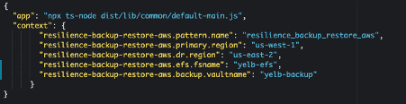

Now let's download the dependencies using command "make deps". 

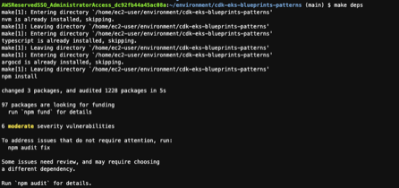

let's build the pattern using command "make build"


let's deploy the pattern using command make pattern resilience-br-backup-aws "deploy --all"

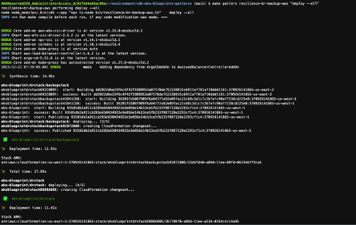

let's confirm the deployment

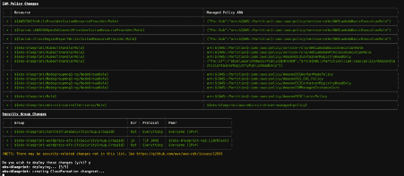

When deployment completes, the output will be similar to the following:

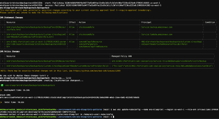


To see the deployed resources within the cluster, please run:

```sh
aws eks update-kubeconfig --name eks-blueprint --region us-west-1 --role-arn arn:aws:iam::XXXXXXXXXXXX:role/eks-blueprint-eksblueprintAccessRoleBA6A9CB7-Fu9TnULIf5O6  # Command Copied from the Stack output

```
The pattern has an argocd controller which configures the storage classes during bootstrap. Now let's check if the storage classes are installed. 

A sample output is shown below:

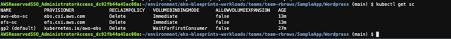

Ensure that the Storage classes aws-ebs-sc and efs-sc are configured during bootstrap by ArgoCD. 

Now let's deploy Yelb application on the EKS cluster 

Clone the repository:

```sh
git clone https://github.com/aws-samples/eks-blueprints-workloads.git

cd eks-blueprints-workloads.git/teams/team-rbraws/SampleApp/Yelb

kubectl apply -f . -R
```

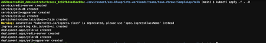

Let's review the service and Ingress

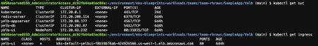

Yelb Services are deployed and an Ingress is configured . Let's access the application and voting for the favourite restaurant. 

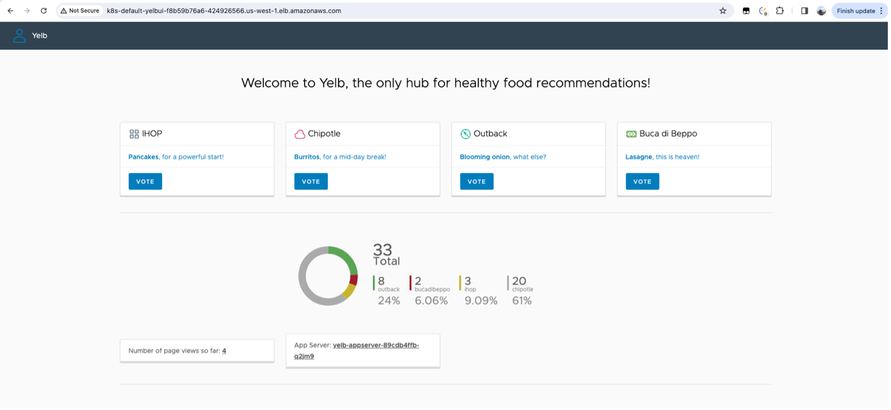

The Yelb application has a postgres database which uses an EBS Volume to persist the data. The EBS volume was dynamically created using the storage class aws-ebs-sc and based on the storage class definition all dynamically provisioned EBS volumes are tagged for backup.

The pattern has also setup a Backup vault and a Backup plan which backup all the EBS Volumes, EFS Filesystesm daily and copies the backups to the DR region. The backup vault is encrypted with a Multiregion KMS key 

Now let's spin up a EKS cluster on the DR region and recreate the EBS from the latest snapshots and deploy the application to confirm that the data is persisted and we are able to recover the application in DR region using the latest snapshots. 

_Note:_ With the default configuration in the pattern you will have to wait for a day to get the backups shipped to the DR region and once the snapshots are available in the DR region , Proceed with the next steps. 

## Disaster Recovery Setup 

### [Step 1:] 

Setup an EKS cluster on the Disaster Recovery region

Let’s start by setting the account and region environment variables:

```sh
ACCOUNT_ID=$(aws sts get-caller-identity --query 'Account' --output text)
AWS_REGION=$(aws configure get region)
```

Clone the repository:

```sh
git clone https://github.com/aws-samples/cdk-eks-blueprints-patterns.git

```

If you haven't done it before, [bootstrap your cdk account and region](https://docs.aws.amazon.com/cdk/v2/guide/bootstrapping.html).

Set the pattern's parameters in the CDK context by overriding the _cdk.json_ file (Update the values for variables based on your environment): 

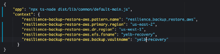

Now let's download the dependencies using command "make deps". 

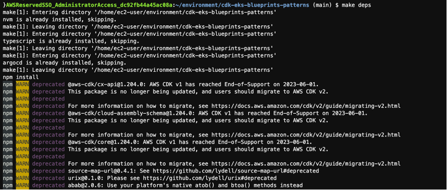

let's build the pattern using command "make build"

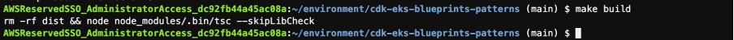

let's deploy the pattern using command make pattern resilience-br-restore-aws "deploy --all"

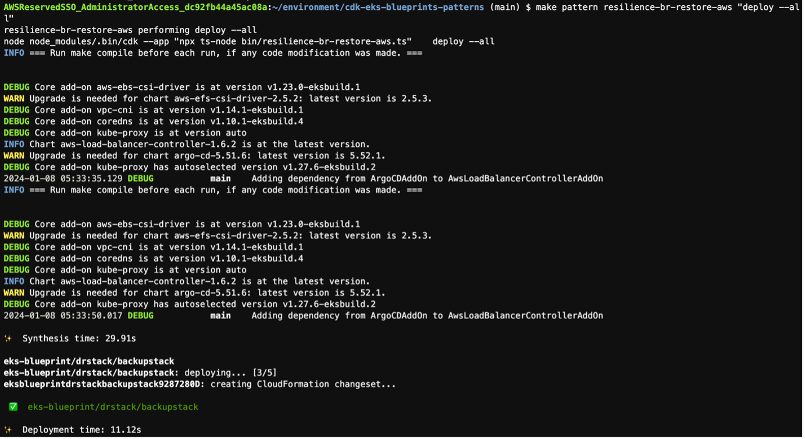

let's confirm the deployment

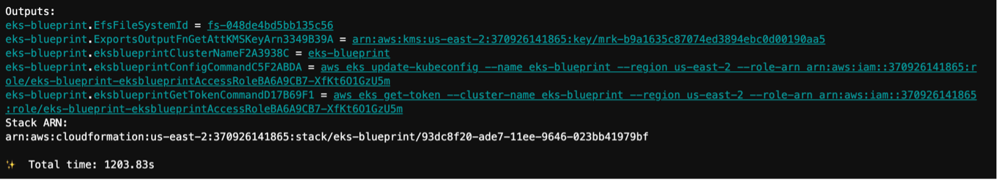

When deployment completes, the output will be similar to the following:

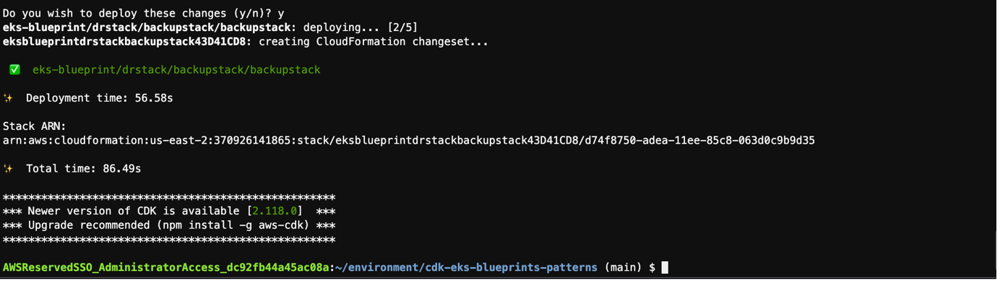


To see the deployed resources within the cluster, please run:

```sh
aws eks update-kubeconfig --name eks-blueprint --region us-west-1 --role-arn arn:aws:iam::XXXXXXXXXXXX:role/eks-blueprint-eksblueprintAccessRoleBA6A9CB7-Fu9TnULIf5O6  # Command Copied from the Stack output

```
The pattern has an argocd controller which configures the storage classes and Volumesnapshot class during bootstrap. Now let's check if the storage classes and Volumesnapshotclass are installed. 

A sample output is shown below:

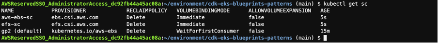

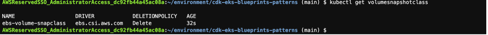


Next, Ensure that the Storage classes aws-ebs-sc, efs-sc and Volumesnapshot class ebs-volume-snapclass are configured during bootstrap by ArgoCD. 


### [Step 2:] 
Download the Manifest files to a Local folder in your Admin Machine which has access to the EKS Cluster. 

```sh

git clone https://github.com/aws-samples/eks-blueprints-workloads.git

```
_Note:_ PersistentVolumeClaim Manifests are updated inline in the next steps; Ensure that you have a backup of all your Manifest files before proceeding further. 

### [Step 3:] 

#### If your application was using an EBS volume as a persistent volume then follow the below steps 

Run the Script to create VolumeSnapshotContent ; VolumeSnapshot from the latest snapshot of the EBS Volume (Used by Application in Primary Region) and Modify PersistentVolumeClaim to reference the VolumeSnapshot.

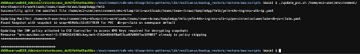


#### If your application was using an EFS Volume as a persistent volume then follow the process outlined in the document below to restore the filesystem from the latest EFS snapshot
``` sh
https://docs.aws.amazon.com/aws-backup/latest/devguide/restoring-efs.html
```

### [Step 4]: ##Only applicable if your application is using EFS_Filesystems
  
Update your PersistentVolume manifest files to reference the new EFS Filesystem id from Step 3 (Sample PersistentVolume Manifest file for reference)

```output
apiVersion: v1
kind: PersistentVolume
metadata:
  name: efs-pv
spec:
  capacity:
    storage: 5Gi
  volumeMode: Filesystem
  accessModes:
    - ReadWriteOnce
  storageClassName: efs-sc
  persistentVolumeReclaimPolicy: Retain
  csi:
    driver: efs.csi.aws.com
    volumeHandle: **fs-e8a95a42**

```
### [Step 5]: 
Deploy the Manifest files to the EKS Cluster in Disaster Recovery Region. 

Navigate to the Local folder where the updated Manifest files are stored 

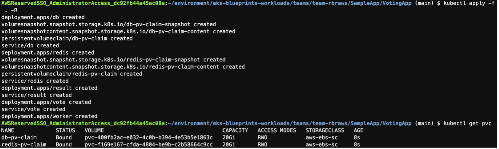

Let's review the services and Ingress 


Kubernetes services are deployed and an Ingress is configured using an application load balancer , Let's grab the url's of Ingress to validate that data is persisted and reflecting in the DR region. 

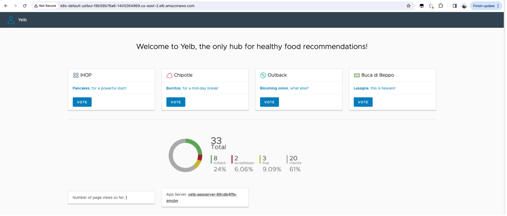

We tried accessing the Ingress url directly here and we could see that the data in the postgres database is reflecting on the DR deployment. 


## Cleanup

To clean up your EKS Blueprints on the Primary Region, run the following commands:

Navigate to the Local folder where the updated Manifest files are stored 

```sh
kubectl delete -f . -R
```
Now let's destroy the cluster. 

```sh
make pattern resilience-br-backup-aws "destroy eks-blueprint/drstack/backupstack/backupstack";
make pattern resilience-br-backup-aws "destroy eks-blueprint/drstack/backupstack";
make pattern resilience-br-backup-aws "destroy eks-blueprint/drstack/drstack";
make pattern resilience-br-backup-aws "destroy eks-blueprint/drstack";
make pattern resilience-br-backup-aws "destroy --all"
```

To clean up your EKS Blueprints on the Disaster Recovery Region, run the following commands:

### [Step 1]:
Remove the KMS policy attached to the CSI Controller Service Account IAM Role 

```sh
csi_role=`kubectl get sa ebs-csi-controller-sa -o json -n kube-system|jq '.metadata.annotations."eks.amazonaws.com/role-arn"'|sed -e 's/"//g'|awk -F"/" '{print $NF}'`
policy_arn=`aws iam list-attached-role-policies --role-name $csi_role|jq .AttachedPolicies[].PolicyArn|grep csi-controller |sed 's/"//g'`
aws iam detach-role-policy --role-name ${csi_role} --policy-arn ${policy_arn}
aws iam delete-policy --policy-arn ${policy_arn}
```
### [Step 2]:
Delete the Deployment on the Disaster Recovery Region

Navigate to the Local folder where the updated Manifest files are stored 

```sh
kubectl delete -f . -R
```
Now let's destroy the cluster. 

```sh
make pattern resilience-br-restore-aws "destroy eks-blueprint/drstack/backupstack/backupstack";
make pattern resilience-br-restore-aws "destroy eks-blueprint/drstack/backupstack";
make pattern resilience-br-restore-aws "destroy eks-blueprint/drstack/drstack";
make pattern resilience-br-restore-aws "destroy eks-blueprint/drstack";
make pattern resilience-br-restore-aws "destroy --all"
```

